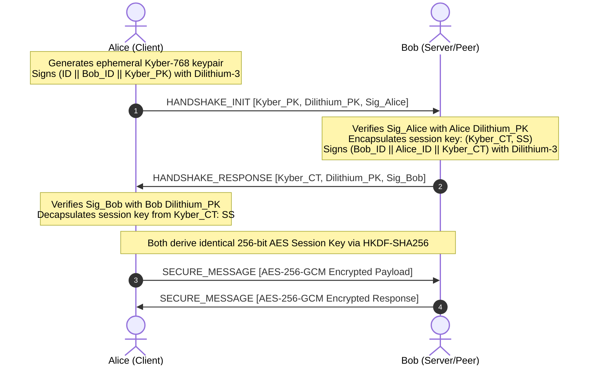

# Q-Shield: Technical Architecture & Cryptographic Specification

## 1. Threat Model & Motivation

### 1.1 The Quantum Threat: Shor's Algorithm
Public-key cryptosystems in ubiquitous use today (RSA, ECDH, ECDSA) rely on the computational hardness of two problems:
1. **Integer Factorization Problem (IFP)** (e.g., RSA-2048, RSA-4096)
2. **Discrete Logarithm Problem (DLP / ECDLP)** (e.g., Diffie-Hellman, NIST Curves P-256, P-384, Ed25519)

Peter Shor's quantum algorithm (1994) solves both IFP and ECDLP in polynomial time:
$$\mathcal{O}((\log N)^2 \cdot \log(\log N) \cdot \log(\log(\log N)))$$
A sufficiently large fault-tolerant quantum computer (~20M physical qubits) will break 2048-bit RSA in less than 8 hours.

### 1.2 "Harvest Now, Decrypt Later" (HNDL)
Adversaries are actively capturing and archiving encrypted government, financial, and military traffic today. When cryptanalytically relevant quantum computers (CRQCs) emerge, this archived data will be retroactively decrypted. Q-Shield prevents HNDL attacks by deploying lattice-based algorithms immediately.

---

## 2. Cryptographic Primitives

Q-Shield adheres strictly to NIST Post-Quantum Cryptography standards:

```
+-------------------------------------------------------------------------+
|                        Q-SHIELD HYBRID ENVELOPE                         |
+-------------------------------------------------------------------------+
|  KEM Layer: CRYSTALS-Kyber-768 (NIST FIPS 203 ML-KEM)                   |
|  - Key encapsulation of ephemeral 256-bit entropy                       |
|  - Public key: 1,184 bytes | Ciphertext: 1,088 bytes                    |
+-------------------------------------------------------------------------+
|  KDF Layer: HKDF-SHA256 (RFC 5869)                                      |
|  - Salt: "Q-Shield-PQC-Hybrid-Salt-v1"                                   |
|  - Output: 256-bit AES-GCM Key                                          |
+-------------------------------------------------------------------------+
|  DEM Layer: AES-256-GCM (NIST SP 800-38D)                               |
|  - 12-byte IV, 16-byte Authentication Tag                               |
|  - Authenticated payload with tamper-proof Associated Data (AAD)        |
+-------------------------------------------------------------------------+
|  Signature Layer: CRYSTALS-Dilithium-3 (NIST FIPS 204 ML-DSA)           |
|  - Fiat-Shamir with Aborts on Module-SIS lattice                        |
|  - Public key: 1,952 bytes | Signature: 3,293 bytes                     |
+-------------------------------------------------------------------------+
```

### 2.1 CRYSTALS-Kyber-768 Parameters
- **Polynomial ring:** $R_q = \mathbb{Z}_q[X]/(X^{256} + 1)$
- **Modulus:** $q = 3329$
- **Rank:** $k = 3$
- **Noise distributions:** $\eta_1 = 2, \eta_2 = 2$ (Centered Binomial Distribution)
- **Compression:** $d_u = 10, d_v = 4$
- **Security Level:** NIST Level 3 (~192-bit quantum security)

### 2.2 Symmetric Encryption (AES-256-GCM)
- Grover's quantum search algorithm reduces symmetric key search from $2^k$ to $2^{k/2}$.
- By utilizing **256-bit** AES keys, post-quantum security remains at **128 bits**, which is mathematically unbreakable by any foreseeable quantum computer.

---

## 3. The `.qvault` Binary Container Format

Files encrypted inside the Quantum Vault are packaged into a binary container:

```
+------------------------+---------------------+-------------------------------+
| Field                  | Type / Length       | Description                   |
+------------------------+---------------------+-------------------------------+
| MAGIC HEADER           | 8 bytes             | ASCII "QSHIELD\x01"            |
| METADATA LENGTH        | 4 bytes (UInt32-BE) | Byte length of envelope JSON  |
| ENVELOPE JSON PAYLOAD  | Variable            | Base64-encoded crypto blocks: |
|                        |                     | - Kyber Ciphertext (1088 B)   |
|                        |                     | - AES IV (12 B)               |
|                        |                     | - Encrypted Payload (GCM)     |
|                        |                     | - Dilithium Signature (3293 B)|
+------------------------+---------------------+-------------------------------+
```

---

## 4. Peer-to-Peer Handshake Protocol



---

## 5. Security Proof Summary
- **MITM Resistance:** Mitigated by Dilithium-3 signature verification on every handshake frame.
- **Forward Secrecy:** Ephemeral Kyber keys guarantee past sessions cannot be decrypted even if long-term identity keys are compromised.
- **Side-Channel Mitigation:** Fixed-rate CBD sampling, constant-time comparison on authentication tags.
